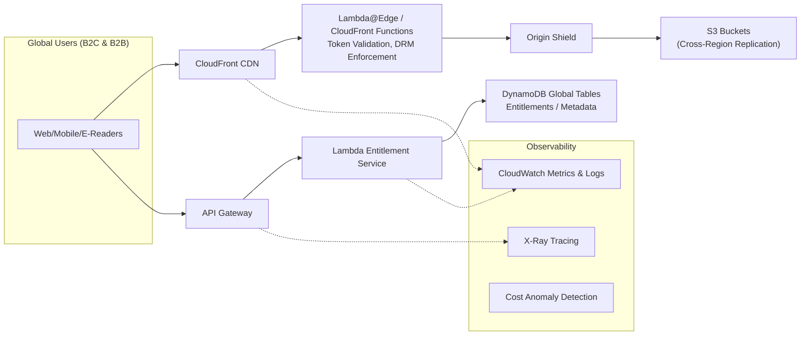

# Boundless Books – Performance-Critical Architecture Decision (AWS)
*A proposal‑ready architecture decision slice based on the case study.*

- [Boundless Books – Performance-Critical Architecture Decision (AWS)](#boundless-books--performance-critical-architecture-decision-aws)
  - [1. Performance‑Critical Problem](#1-performancecritical-problem)
  - [2. Key Non‑Functional Requirements (NFRs)](#2-key-nonfunctional-requirements-nfrs)
    - [Performance](#performance)
    - [Availability \& Resilience](#availability--resilience)
    - [Security \& DRM](#security--drm)
    - [Cost Efficiency](#cost-efficiency)
    - [Interoperability](#interoperability)
    - [Observability](#observability)
- [Key Architecture Decision (ADR)](#key-architecture-decision-adr)
  - [ADR‑001:  Consider an architectural pattern for high‑performance content distribution solution](#adr001--consider-an-architectural-pattern-for-highperformance-content-distribution-solution)
      - [Context](#context)
    - [Chosen Option (Option 1): Adopt AWS S3 + CloudFront as a global secured content distribution layer with serverless entitlement APIs and DynamoDB Global Tables for entitlement metadata.](#chosen-option-option-1-adopt-aws-s3--cloudfront-as-a-global-secured-content-distribution-layer-with-serverless-entitlement-apis-and-dynamodb-global-tables-for-entitlement-metadata)
      - [Decision](#decision)
      - [Status](#status)
      - [Consequences](#consequences)
  - [Considered options](#considered-options)
    - [Option 1. CloudFront + S3 + Serverless Entitlement (Chosen)](#option-1-cloudfront--s3--serverless-entitlement-chosen)
    - [Option 3. Multi‑Region Containerized Delivery (ECS/EKS + ALB)](#option-3-multiregion-containerized-delivery-ecseks--alb)
    - [Option 4. DynamoDB Global Tables + API Gateway + Pre‑Signed S3 URLs](#option-4-dynamodb-global-tables--api-gateway--presigned-s3-urls)
    - [Option 5. Real‑Time DRM Transformation Gateway (On‑the‑fly Encryption/Watermarking)](#option-5-realtime-drm-transformation-gateway-onthefly-encryptionwatermarking)
- [GenAI‑Assisted Operational Enhancements](#genaiassisted-operational-enhancements)
  - [Predictive Autoscaling](#predictive-autoscaling)
  - [AI‑Driven Cost/Performance Optimization](#aidriven-costperformance-optimization)
  - [Anomaly Detection for DRM \& Access Patterns](#anomaly-detection-for-drm--access-patterns)
  - [Accelerated Modernization](#accelerated-modernization)
  - [GenAI Incident Copilot](#genai-incident-copilot)
- [Stakeholder Impact](#stakeholder-impact)
  - [Business Stakeholders](#business-stakeholders)
  - [Technical Stakeholders](#technical-stakeholders)

---

## 1. Performance‑Critical Problem

Boundless Books must deliver **global, low‑latency digital content (e‑books, interactive media, DRM‑protected assets)** to B2C and B2B channels while legacy systems remain operational.  
Key challenge: meeting strict performance constraints:

- **p95 ≤ 200 ms globally**  
- **10× burst scaling within 5 minutes**  
- **99.95% availability**  
- High egress volumes with tight cost constraints  

---

## 2. Key Non‑Functional Requirements (NFRs)

### Performance
- Sub‑200 ms global read latency  
- Near‑instant elasticity to absorb 10× spikes  
- Efficient caching/offloading of origins

### Availability & Resilience
- 99.95% availability  
- Multi‑Region failover capability  
- Graceful degradation under load

### Security & DRM
- Device‑bound, expiring signed URLs  
- Token‑based entitlement checks  
- Anomaly detection for abuse/scraping

### Cost Efficiency
- Strict egress cost optimization  
- Intelligent storage class transitions  
- High cache hit ratios to protect budget

### Interoperability
- Must operate **concurrently** with legacy editorial and distribution systems

### Observability
- SLO dashboards  
- Tracing across CDN → API → datastore  
- Automated operational insights

---

# Key Architecture Decision (ADR)

## ADR‑001:  Consider an architectural pattern for high‑performance content distribution solution

#### Context
Boundless Books needs fast, secure, cost‑controlled delivery of digital assets at global scale. The distribution layer must be independent of legacy systems while supporting modern DRM and AI‑enabled operations.

### Chosen Option (Option 1): Adopt AWS S3 + CloudFront as a global secured content distribution layer with serverless entitlement APIs and DynamoDB Global Tables for entitlement metadata.

#### Decision
- Use **Amazon CloudFront** with **Signed URLs/Cookies**, **Origin Shield**, and **edge functions** for lightweight token validation.  
- Store digital content in **Amazon S3**, with cross‑Region replication.  
- Build entitlement/DRM APIs with **API Gateway + AWS Lambda**.  
- Use **DynamoDB Global Tables** for globally distributed entitlement metadata.  
- Identity handled through **Amazon Cognito** (B2C) + **SAML/OIDC federation** (B2B).  
- **EventBridge** drives predictive autoscaling and operational workflows.  
- Observability using **CloudWatch**, **X‑Ray**, **AWS Budgets**, and **Cost Anomaly Detection**.

#### Status
**Approved** for implementation in Phase 1 (digital delivery tier).

#### Consequences
- **Pros:**  
  - Edge caching achieves sub‑200 ms latency  
  - Highly elastic with minimal ops overhead  
  - Strong, scalable DRM model  
  - Cost‑efficient for high-read workloads  
- **Cons:**  
  - Complex token lifecycle  
  - DRM logic at the edge must remain lightweight  
  - Egress remains a cost-sensitive dimension

---

## Considered options
### Option 1. CloudFront + S3 + Serverless Entitlement (Chosen)
**Strengths:**
- Best global latency & burst performance  
- Excellent cache offload  
- Low operational overhead  
- Flexible DRM patterns

**Weaknesses:**
- Limited heavy edge computation  
- Token lifecycle adds complexity  

---

### Option 3. Multi‑Region Containerized Delivery (ECS/EKS + ALB)
**Strengths:**
- Full control over application logic  
- Suitable for heavy personalization or compute-intensive DRM  

**Weaknesses:**
- Containers require careful warm‑up to meet 5‑minute 10× bursts  
- Higher operating cost and complexity  
- Still requires CloudFront for global latency targets  

---

### Option 4. DynamoDB Global Tables + API Gateway + Pre‑Signed S3 URLs
**Strengths:**
- Ultra‑low‑latency entitlement checks  
- Ideal for B2B bulk-access scenarios  
- Excellent scaling and high availability  

**Weaknesses:**
- Still depends on CloudFront for content delivery  
- Adds metadata lookup hop  
- Requires cache tuning for hot partitions  

---

### Option 5. Real‑Time DRM Transformation Gateway (On‑the‑fly Encryption/Watermarking)
**Strengths:**
- Very strong DRM posture  
- Per‑request individualized assets  

**Weaknesses:**
- Expensive under load; misses 200 ms targets  
- CPU/IO heavy; not suitable for 10× spikes  
- Best for small subset of high‑value content  

---

# GenAI‑Assisted Operational Enhancements

## Predictive Autoscaling
- Train models on historical traffic, events, release cycles  
- Pre‑warm Lambda provisioned concurrency  
- Pre‑scale DynamoDB and adjust CloudFront TTL invalidations

## AI‑Driven Cost/Performance Optimization
- Daily model-run generates recommendations for:  
  - Cache behavior adjustments  
  - Storage tier transitions  
  - API throttling thresholds  
- Human-in-the-loop approvals via IaC change sets

## Anomaly Detection for DRM & Access Patterns
- Detect scraping, token sharing, unusual geolocation spikes  
- Apply automated mitigations: short TTLs, forced re-auth, rate limit

## Accelerated Modernization
- Use LLMs to assist with:  
  - Legacy code refactoring  
  - Metadata enrichment & tagging  
  - API shim generation during migration

## GenAI Incident Copilot
- Converts logs/traces into diagnostics  
- Suggests mitigation actions  
- Reduces MTTR

---

# Stakeholder Impact

## Business Stakeholders
- **Faster time-to-market** for digital content  
- **SLA compliance** reduces B2B penalty exposure  
- **Revenue growth** via personalization and reduced friction  
- **Predictable cloud spend** through AI‑based cost optimization  
- **Brand enhancement** from improved UX

## Technical Stakeholders
- Simplified architecture enabling high performance  
- Strong, auditable DRM with anomaly detection  
- Reduced operational burden with serverless + AI-runbooks  
- Resilience through global distribution and replication  
- Smooth coexistence with legacy systems during transition

---
