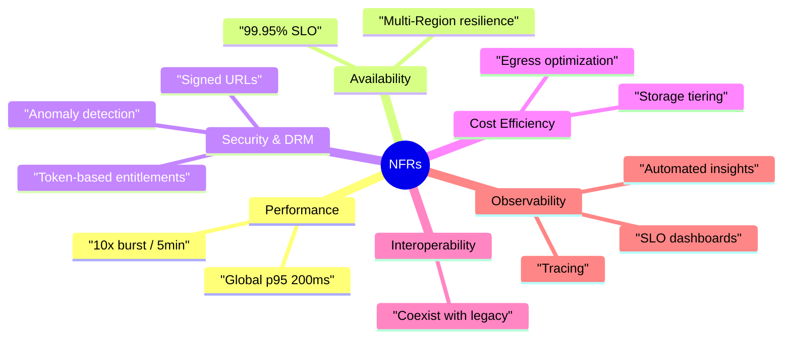
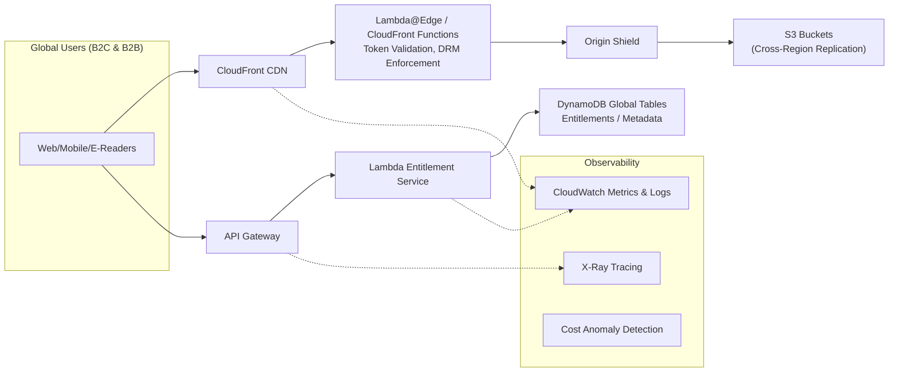
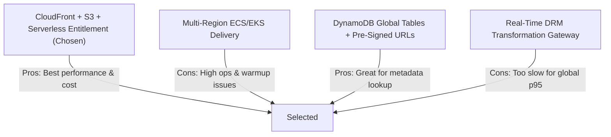
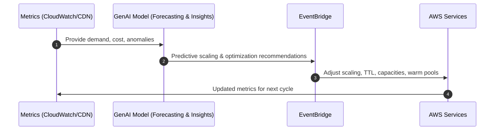
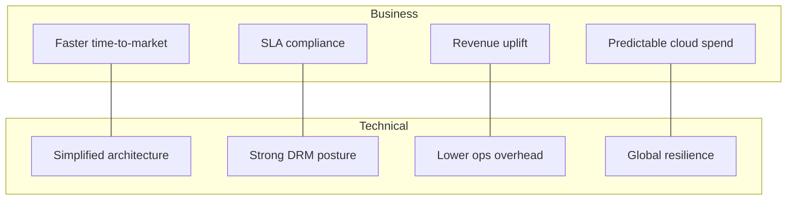

# Boundless Books – Performance‑Critical Architecture Decision (AWS)
*A proposal‑ready architecture decision slice with diagrams.*

---

## 1. Performance‑Critical Problem

Boundless Books must deliver **global, low‑latency digital content** (e‑books, interactive media, DRM‑protected assets) to B2C and B2B channels while legacy systems remain operational.

### Performance Constraints
- **p95 ≤ 200 ms** globally  
- **10× burst scaling** within 5 minutes  
- **99.95% availability**  
- Cost optimization required for high‑egress content

---

## 2. Key Non‑Functional Requirements (NFRs)

### NFR Overview Diagram

---

## 3. Key Architecture Decision (ADR)

### ADR‑001: Use S3 + CloudFront for global content distribution with serverless entitlements and DynamoDB Global Tables.

### High‑Level Architecture (Mermaid Diagram)

---

## 4. Architectural Alternatives & Trade‑offs

### Alternatives Comparison Diagram

---

## 5. GenAI-Assisted Operational Enhancements

### GenAI Operational Flow Diagram

---

## 6. Stakeholder Impact

### Impact Diagram

---

## 7. Final Notes & Next Steps
- Run performance tests (p95, burst scaling)  
- Validate DRM enforcement at edge  
- Enable GenAI pipeline for operations  
- Prepare production rollout plan  

---
